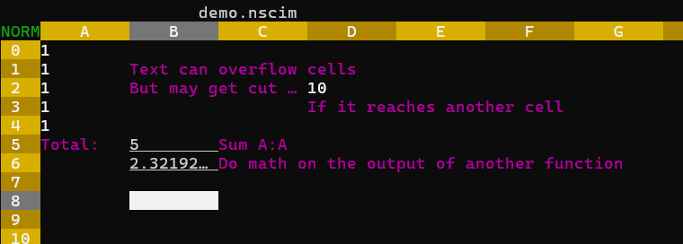

# neoscim

*New* Spreadsheet Calculator Improved

Based loosely off sc-im (spreadsheet calculator improvised), which has dumb keybinds and not many features.

[Checkout a demo file](readme/demo.nscim), download, then open with `neoscim demo.nscim`.

## Keybinds

### Normal mode

| Key | Action |
| - | - |
| `j` | Move down |
| `k` | Move up |
| `h` | Move left |
| `l` | Move right |
| `0` | Go to beginning of the row |
| `g0` | Go to beginning of the visual row |
| `$` | Go to end of the row |
| `g$` | Go to end of the visual row |
| `gg` | Go to beginning of the column |
| `G` | Go to end of column |
| `gG` | Go to end of the the visual column |
| `i`/`a` | Enter insert mode on current cell |
| `r` | Enter insert mode on current cell, deleting contents |
| `v` | Enter visual mode |
| `:` | Enter command mode |
| `O` | Insert row above cursor |
| `o` | Insert row below cursor |
| `A` | Insert column after cursor |
| `I` | Insert column before cursor |
| `yy` | Yank current cell |
| `d `/`dw` | Cut current cell |
| `p` | Paste clipboard (cursor is top-left of multi-cell pastes). Automatically translates cell references |
| `gp` | Paste clipboard, no reference translation |
| `zz` | Center grid on cursor |
| `m`X | Mark cell "X" |
| `'`X | Jump to cell "X" |
| n`G` | Jump to row "n" |
| nX | Press "X", "n" times |

### Visual mode

| Key | Action |
| - | - |
| `y` | Yank selection (visual mode) |
| `d`/`x` | Cut selection (visual mode) |

### Commands

| Command | Description |
| - | - |
| `:set <key>=<value>` | Sets `key` to `value`, currently supports `length` and `height` for changing cell size |
| `:w` | Saves changes to file you opened |
| `:w <file>` | Saves changes to `file`, setting it as the default file if there is not already one |
| `:q` | Quit program |
| `:q!` | Quit program, even if the file isn't saved |

#### Visual mode commands

These commands operate on selections.

| Commmand | Description |
| - | - |
| `:plot` | Plots the current selection to `plot.png` using gnuplot |
| `:export <filename>` | Exports the current selection to a new file |

## Math / Functions

### Math

| Symbol | Operation |
| - | - |
| + | Add |
| - | Subtract |
| * | Multiply |
| / | Divide |
| ^ | Exponent |
| % | Modulo |

### Functions

| Identifier            | Arg Qty           | Argument Types                | Description |
| -                     | -                 | -                             | - |
| `avg`                 | ≥ 1               | Numeric        				| Returns the average of the arguments |
| `sum`                 | ≥ 1               | Numbers 						| Returns the sum of the arguments |
| `xlookup`             | 3                 | Number/String, Range, Range 	| Searches for the number/string in the first range, returning the item at the same index in the second range |
| `min`                 | ≥ 1               | Numeric                       | Returns the minimum of the arguments |
| `max`                 | ≥ 1               | Numeric                       | Returns the maximum of the arguments |
| `len`                 | 1                 | String/Tuple                  | Returns the character length of a string, or the amount of elements in a tuple (not recursively) |
| `floor`               | 1               	| Numeric                       | Returns the largest integer less than or equal to a number |
| `round`               | 1               	| Numeric                       | Returns the nearest integer to a number. Rounds half-way cases away from 0.0 |
| `ceil`                | 1               	| Numeric                       | Returns the smallest integer greater than or equal to a number |
| `if`                  | 3               	| Boolean, Any, Any             | If the first argument is true, returns the second argument, otherwise, returns the third  |
| `contains`            | 2               	| Tuple, any non-tuple          | Returns true if second argument exists in first tuple argument. |
| `contains_any`        | 2               	| Tuple, Tuple of any non-tuple | Returns true if one of the values in the second tuple argument exists in first tuple argument. |
| `typeof`              | 1               	| Any                           | returns "string", "float", "int", "boolean", "tuple", or "empty" depending on the type of the argument  |
| `math::is_nan`        | 1               	| Numeric                       | Returns true if the argument is the floating-point value NaN, false if it is another floating-point value, and throws an error if it is not a number  |
| `math::is_finite`     | 1               	| Numeric                       | Returns true if the argument is a finite floating-point number, false otherwise  |
| `math::is_infinite`   | 1               	| Numeric                       | Returns true if the argument is an infinite floating-point number, false otherwise  |
| `math::is_normal`     | 1               	| Numeric                       | Returns true if the argument is a floating-point number that is neither zero, infinite, [subnormal](https://en.wikipedia.org/wiki/Subnormal_number), or NaN, false otherwise  |
| `math::ln`            | 1               	| Numeric                       | Returns the natural logarithm of the number |
| `math::log`           | 2               	| Numeric, Numeric              | Returns the logarithm of the number with respect to an arbitrary base |
| `math::log2`          | 1               	| Numeric                       | Returns the base 2 logarithm of the number |
| `math::log10`         | 1               	| Numeric                       | Returns the base 10 logarithm of the number |
| `math::exp`           | 1               	| Numeric                       | Returns `e^(number)`, (the exponential function) |
| `math::exp2`          | 1               	| Numeric                       | Returns `2^(number)` |
| `math::pow`           | 2               	| Numeric, Numeric              | Raises a number to the power of the other number |
| `math::cos`           | 1               	| Numeric                       | Computes the cosine of a number (in radians) |
| `math::acos`          | 1               	| Numeric                       | Computes the arccosine of a number. The return value is in radians in the range [0, pi] or NaN if the number is outside the range [-1, 1] |
| `math::cosh`          | 1               	| Numeric                       | Hyperbolic cosine function |
| `math::acosh`         | 1               	| Numeric                       | Inverse hyperbolic cosine function |
| `math::sin`           | 1               	| Numeric                       | Computes the sine of a number (in radians) |
| `math::asin`          | 1               	| Numeric                       | Computes the arcsine of a number. The return value is in radians in the range [-pi/2, pi/2] or NaN if the number is outside the range [-1, 1] |
| `math::sinh`          | 1               	| Numeric                       | Hyperbolic sine function |
| `math::asinh`         | 1               	| Numeric                       | Inverse hyperbolic sine function |
| `math::tan`           | 1               	| Numeric                       | Computes the tangent of a number (in radians) |
| `math::atan`          | 1               	| Numeric                       | Computes the arctangent of a number. The return value is in radians in the range [-pi/2, pi/2] |
| `math::atan2`         | 2               	| Numeric, Numeric              | Computes the four quadrant arctangent in radians |
| `math::tanh`          | 1               	| Numeric                       | Hyperbolic tangent function |
| `math::atanh`         | 1               	| Numeric                       | Inverse hyperbolic tangent function. |
| `math::sqrt`          | 1               	| Numeric                       | Returns the square root of a number. Returns NaN for a negative number |
| `math::cbrt`          | 1               	| Numeric                       | Returns the cube root of a number |
| `math::hypot`         | 2               	| Numeric                       | Calculates the length of the hypotenuse of a right-angle triangle given legs of length given by the two arguments |
| `math::abs`           | 1               	| Numeric                       | Returns the absolute value of a number, returning an integer if the argument was an integer, and a float otherwise |
| `str::to_lowercase`   | 1               	| String                        | Returns the lower-case version of the string |
| `str::to_uppercase`   | 1               	| String                        | Returns the upper-case version of the string |
| `str::trim`           | 1               	| String                        | Strips whitespace from the start and the end of the string |
| `str::from`           | ≥ 0            	| Any                           | Returns passed value as string |
| `str::substring`      | 3               	| String, Int, Int              | Returns a substring of the first argument, starting at the second argument and ending at the third argument. If the last argument is omitted, the substring extends to the end of the string |
| `bitand`              | 2               	| Int                           | Computes the bitwise and of the given integers |
| `bitor`               | 2               	| Int                           | Computes the bitwise or of the given integers |
| `bitxor`              | 2               	| Int                           | Computes the bitwise xor of the given integers |
| `bitnot`              | 1               	| Int                           | Computes the bitwise not of the given integer |
| `shl`                 | 2               	| Int                           | Computes the given integer bitwise shifted left by the other given integer |
| `shr`                 | 2               	| Int                           | Computes the given integer bitwise shifted right by the other given integer |

> Cells are interchangeable with numbers, ex: `math::pow(A1,B1)` or `math::pow(1,2)`.

> Any time a function takes a variable amount of inputs, a range can be specified: `avg(B:B)`.

## Improvements from sc-im

* Cell type (string, function, value) are all "the same" and use polymorphism to detect what you are trying to do.
If the cell can be a number (parsed into a float) it will be, if not, then if the string starts with "=", then treats it as an equation, otherwise, it's a string.

* Cell references move with copy / paste
    * =A0: Will translate
    * =$A0: Will translate Y only (numbers)
    * =A$0: Will translate X only (letters)
    * =$A$0: No translation

* Keybinds are closer to vim keying (i/a start inserting into a cell)

## FAQ:

* Every number is a float (or will end up as a float)
* If you want to add more functions, do so in [get_functions()](https://git.oliveratkinson.net/Oliver/sc_rs/src/branch/master/src/app/logic/ctx.rs).
* If you terminal isn't showing outputs of functions, it may be that your terminal doesn't support underlines. Try opening the program inside TMUX to see if that fixes it (this solves it for the Windows 11 cmd terminal).
